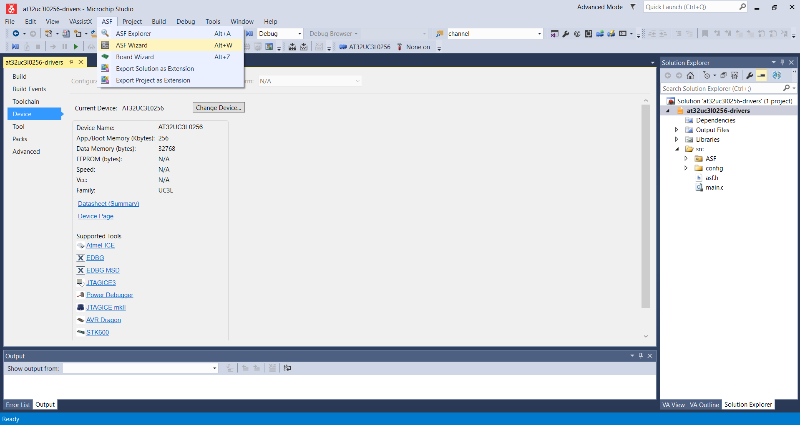
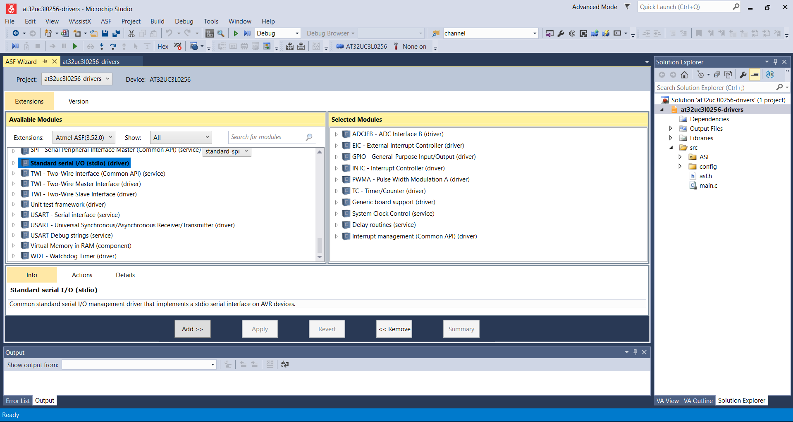
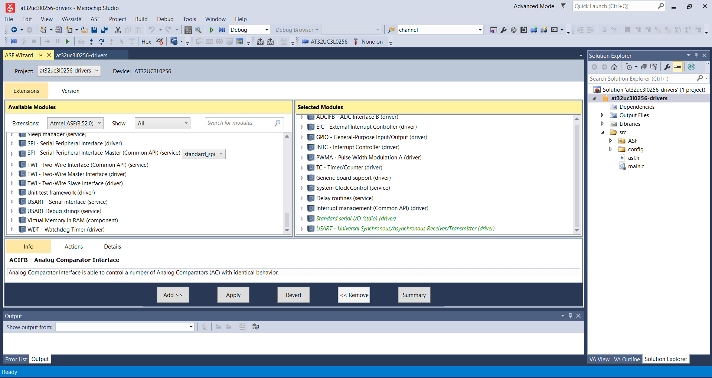
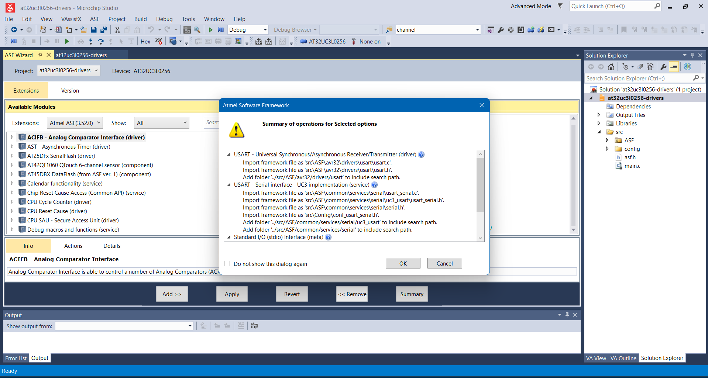
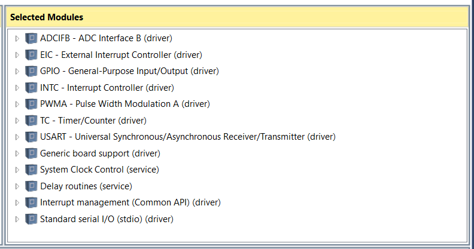

# AT32UC3L0256 Drivers

- AT32UC3L0256 MCU driver libraries to be built for both the MCU and Windows (for unit testing) w/ CMake
- This layer gets Microchip Studio IDE driver files to adhere to the Hardware Abstraction Layer

## ASF_mock

- Drivers copied from the Microchip Studio IDE has assembly files, conditionally compiled headers, etc. that only builds w/ the AVR32 compiler
- ASF_mock defines the bare minimum constants/functions to decouple ASF driver files from code that only builds w/ the AVR32 compiler

## Copying AT32UC3L0256 Drivers w/ Microchip Studio IDE

- Create a project
  - Create a project w/ Microchip studio targeting the AT32UC3l0256 MCU
  - Click on `ASF` (Atmel Software Framework) -> `ASF Wizard` at the top
  - 
- Select needed drivers
  - Search for all the drivers you need, and click `Add`
  - 
- Apply added drivers
  - Apply the drivers you selected to your project by clicking `Apply`
  - 
- Click `OK` on the warning popup window showing all files that will be modified/added
  - 
- That's it!
  - Your project can now be diff'ed against `ASF/` in this repository to be added accordingly
  - The current full set of copied drivers is as below:
  - 
